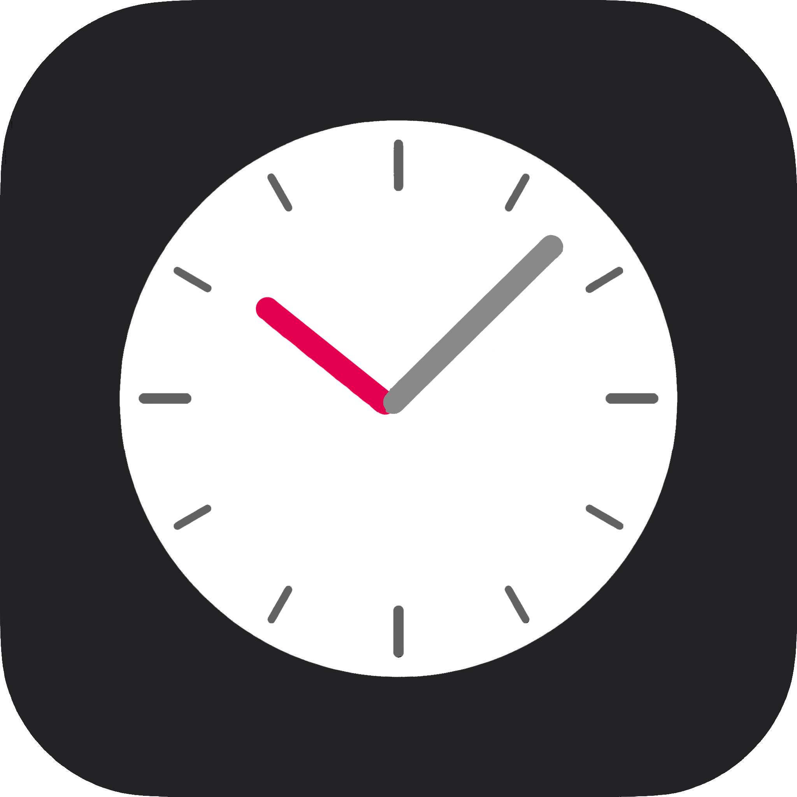

# 桌面计时器

一个简洁美观的桌面计时器应用，支持计时、暂停、重置等功能。

## 功能特点

- ✨ 简洁美观的界面设计
- ⏱️ 精确的计时功能
- ⏸️ 支持暂停和继续
- 🔄 支持重置计时器
- 🔔 计时结束提醒
- 🎨 可自定义界面颜色
- 📱 支持系统托盘图标

## 截图



## 安装方法

### 方法1：下载可执行文件（推荐）

1. 从 [Releases](https://github.com/LeslieLeo/desktop-timer/releases) 页面下载最新版本的 `.exe` 文件
2. 双击运行即可使用

### 方法2：从源代码运行

1. 克隆仓库：
```bash
git clone https://github.com/LeslieLeo/desktop-timer.git
cd desktop-timer
```

2. 安装依赖：
```bash
pip install -r requirements.txt
```

3. 运行程序：
```bash
python timer_app.py
```

## 使用方法

1. 启动程序后，计时器会自动开始计时
2. 点击"暂停"按钮可以暂停计时
3. 点击"继续"按钮可以继续计时
4. 点击"重置"按钮可以重置计时器
5. 可以通过滑动条调整计时速度
6. 计时结束后会播放提示音

## 技术栈

- Python 3.x
- PyQt6
- PyInstaller

## 开发计划

- [ ] 添加倒计时功能
- [ ] 支持多个计时器
- [ ] 添加计时记录功能
- [ ] 支持自定义提醒音
- [ ] 添加主题切换功能

## 贡献

欢迎提交 Issue 和 Pull Request！

## 许可证

MIT License

## 作者

LeslieLeo

## 致谢

感谢所有使用和贡献这个项目的用户！
